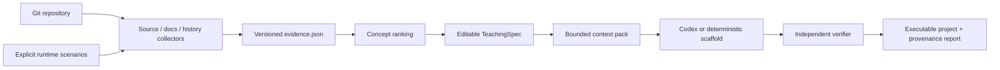

# Repo Distiller

[](https://github.com/ZoukiLi/repo-distiller/actions/workflows/examples.yml)

Repo Distiller turns a bounded analysis of a source repository into a small, executable Python
teaching project. It keeps deterministic evidence collection separate from Agent judgment, emits an
editable `TeachingSpec`, gives the Coding Agent only a hash-bound context pack, and verifies the
result without calling the model that generated it.

It is not a source-to-source compiler and it does not promise drop-in compatibility. Its output is a
tested simulation of a selected semantic closure: public interface, core mechanisms, and important
correctness rules. Performance machinery, compatibility breadth, and optional ecosystem features
remain visible as explicit omissions.

## Install and run

Repo Distiller requires Python 3.11 or newer and has no runtime dependencies.

```bash
uv tool install .
repo-distiller run /path/to/repository --backend auto
```

The `auto` backend uses the local Codex CLI when available. If it is unavailable or fails, the run
falls back to an explicitly labeled executable concept/state scaffold. Use `--backend codex` when a
behavior-oriented Agent implementation is mandatory; that mode fails instead of silently falling
back.

Add representative source behavior only when you trust the repository and command:

```bash
repo-distiller run /path/to/repository \
  --scenario "python -m the_tool --help" \
  --scenario "python -m unittest discover -s tests" \
  --allow-exec \
  --backend codex
```

Runtime commands are never inferred or executed by default. With `--allow-exec`, each supplied
command runs in a fresh copy with VCS data and common build caches removed. A copied workspace is a
containment boundary, not an OS security sandbox; do not execute untrusted repositories on a host
that contains secrets.

## Pipeline



The individual stages can also be inspected and rerun:

```bash
repo-distiller analyze <repo>
repo-distiller spec <run>/evidence.json
repo-distiller build <run>/teaching-spec.json --backend codex
repo-distiller verify <run>/generated-project
```

Each command prints its primary artifact. `run` prints the run directory.
Agent model and effort remain at the user's configured defaults unless `--agent-model` and
`--agent-reasoning` are supplied.

## What a run records

Every run lives under `.repo-distiller/runs/<timestamp>-<repo>-<id>/` by default:

```text
run-manifest.json          input, tool version, stages, failures, human overrides
evidence.json              repository identity and typed source/docs/history/runtime facts
TEACHING_SPEC.md           readable teaching contract
teaching-spec.json         machine-readable, evidence-bound contract
context/                   selected source files and exact Agent inputs
agent-prompt.txt           complete synthesis prompt (Codex backend)
agent-stdout.jsonl         live Agent event stream
agent-stderr.log           Agent diagnostics
agent-last-message.txt     final Agent response
build-metadata.json        backend, prompt/context/output digests and fallback reason
generated-project/         runnable Python teaching artifact
verification-report.json  structural checks, commands, output, metrics and tree digest
```

Facts, inferences, unknowns, truncation warnings, failed collectors, source commit/dirty state, and
the selected backend are retained rather than erased. A user can apply controlled spec edits with
`repo-distiller spec ... --overrides changes.json`; accepted keys and the override file digest are
recorded in `run-manifest.json`.

## Case studies

[`case-studies/uv`](case-studies/uv/) contains the original hand-curated uv → toyuv baseline.
`toyuv` implements requirements, backtracking resolution, locking, exact environment sync, artifact
validation, rollback, and CLI workflows. Its independent verifier runs 15 tests plus a transitive
install/import and a conflict rollback scenario:

```bash
python scripts/verify_toyuv.py
```

The case study is evidence that the target artifact can be educational and executable. It is kept
separate from engine runs so the earlier manual work is not misrepresented as automated output.

[`case-studies/itsdangerous`](case-studies/itsdangerous/) is the first complete generic-engine case.
It records a public source commit and portable TeachingSpec, and checks in the Codex-generated
HMAC/key-rotation/serialization/timestamp model. Re-run its generic verifier with:

```bash
python scripts/verify_itsdangerous_case.py
```

## Repository layout

```text
src/repo_distiller/        generic CLI, schemas, collectors, planning, synthesis, verification
tests/                     engine unit and end-to-end tests
docs/                      method and artifact contracts
case-studies/uv/           hand-curated first baseline and source-bound evidence
case-studies/itsdangerous/ automated generic-engine case and portable evidence
scripts/verify_toyuv.py    independent legacy case verifier
```

See [`docs/METHOD.md`](docs/METHOD.md) for the selection model and
[`docs/ARTIFACTS.md`](docs/ARTIFACTS.md) for the machine-readable contracts.
